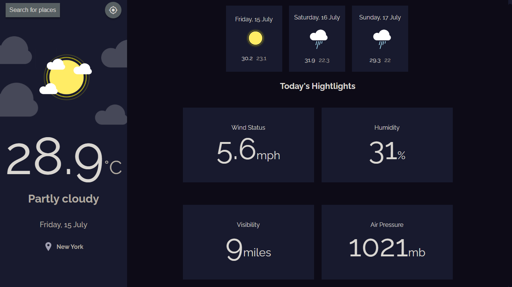

<!-- Please update value in the {}  -->

<h1 align="center">Weather App</h1>

<div align="center">
   Solution for a challenge from  <a href="http://devchallenges.io" target="_blank">Devchallenges.io</a>.
</div>

<div align="center">
  <h3>
    <a href="https://weather-app-francocarballar.vercel.app/">
      Demo
    </a>
    <span> | </span>
    <a href="https://{your-url-to-the-solution}">
      Solution
    </a>
    <span> | </span>
    <a href="https://devchallenges.io/challenges/mM1UIenRhK808W8qmLWv">
      Challenge
    </a>
  </h3>
</div>

<!-- TABLE OF CONTENTS -->

## Table of Contents

- [Overview](#overview)
  - [Built With](#built-with)
- [Features](#features)
- [How to use](#how-to-use)
- [Contact](#contact)

<!-- OVERVIEW -->

## Overview



### Built With

- [React](https://reactjs.org/)

## Used technologies

- React
- Responsive Design (Following the Mobile First methodology)

## Figma design:

https://www.figma.com/file/5X3Ao3gEqZPqqKctP7riDF/weather-app?node-id=1%3A112

## Features

This application/site was created as a submission to a [DevChallenges](https://devchallenges.io/challenges) challenge. The [challenge](https://devchallenges.io/challenges/mM1UIenRhK808W8qmLWv) was to build an application to complete the given user stories.

## How To Use

To clone and run this application, you'll need [Git](https://git-scm.com) and [Node.js](https://nodejs.org/en/download/) (which comes with [npm](http://npmjs.com)) installed on your computer. From your command line:


### Clone this repository
```
$ git clone https://github.com/francocarballar/weather-app
```

### Install dependencies
```
$ npm install react
$ npm install react-dom
$ npm install standard
```

### Run the app
```
$ npm start
```

## Contact

- GitHub [@francocarballar](https://{github.com/francocarballar})
- Twitter [@francocarballa](https://{twitter.com/francocarballa})